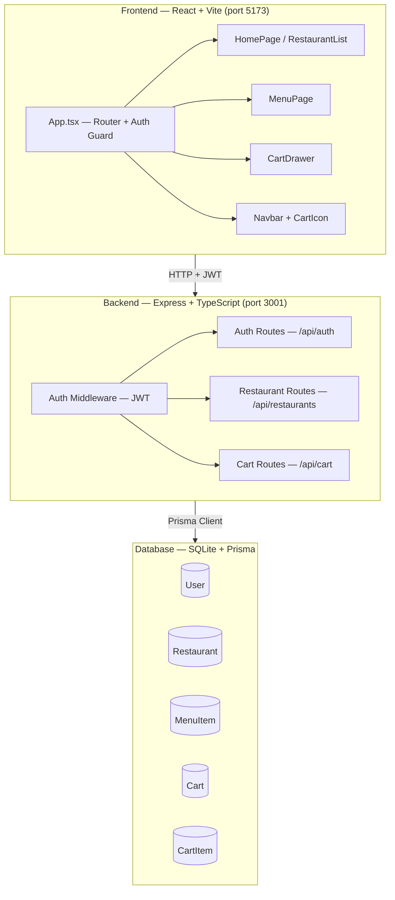
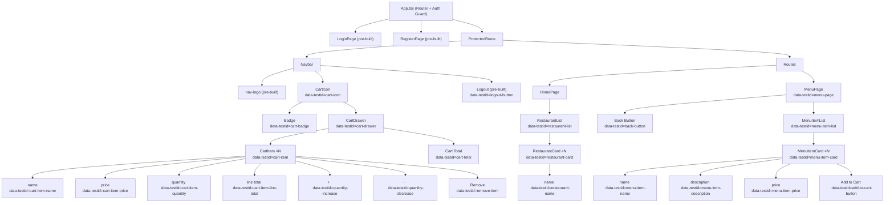
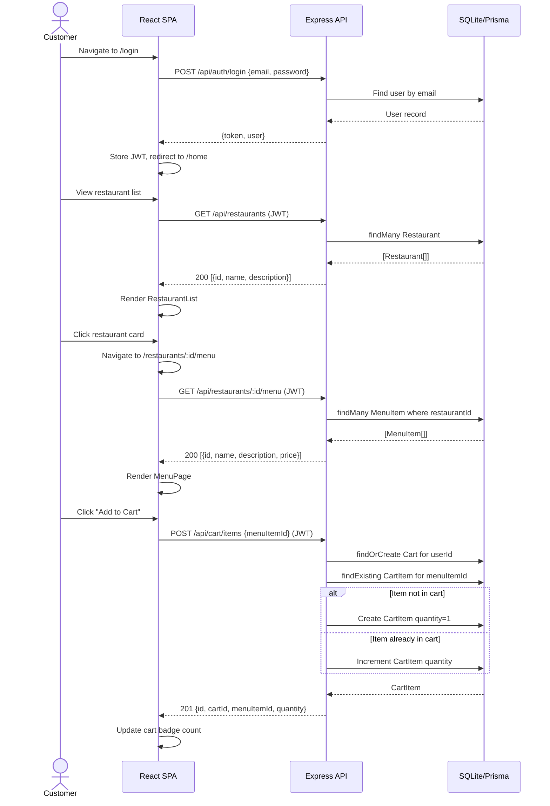
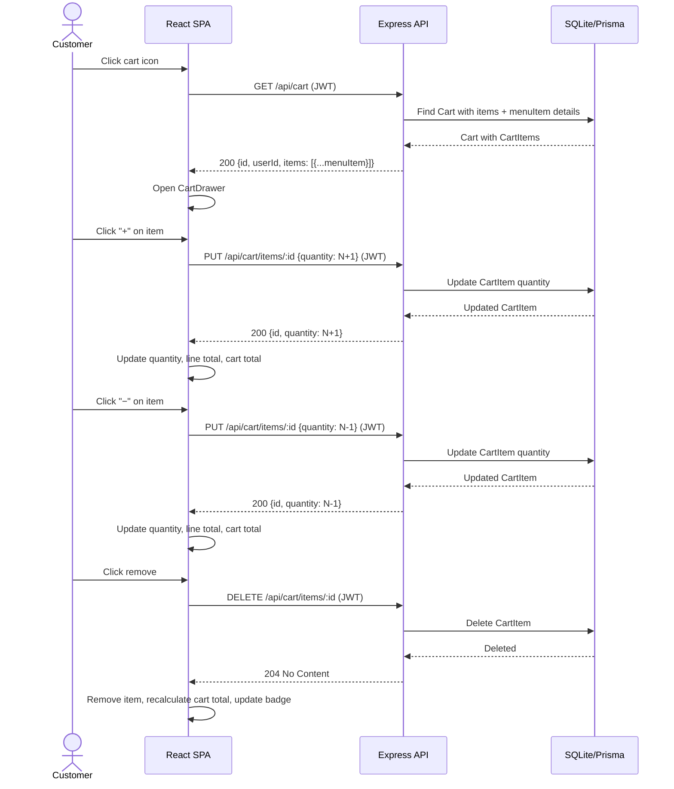

# FoodOrder — Design Document
**Date:** 2026-03-09
**Source:** BRD.md + GitHub Issues

## 1. Architecture Overview

FoodOrder is a three-tier web application built on a pre-existing authentication scaffold. The frontend is a React SPA served by Vite, the backend is an Express REST API, and data is persisted in SQLite via Prisma ORM. All domain API endpoints require JWT authentication.



### Tier Responsibilities

| Tier | Technology | Responsibility |
|------|-----------|----------------|
| Frontend | React 18 + TypeScript + Vite | SPA rendering, routing, cart state management, API calls |
| Backend | Express 4 + TypeScript | REST API, JWT auth, business logic, Prisma queries |
| Database | SQLite + Prisma ORM | Data persistence, schema migrations, seed data |

---

## 2. Data Model

### Complete Prisma Schema

```prisma
generator client {
  provider = "prisma-client-js"
}

datasource db {
  provider = "sqlite"
  url      = env("DATABASE_URL")
}

// PRE-BUILT — do not modify
model User {
  id        Int      @id @default(autoincrement())
  email     String   @unique
  password  String
  name      String
  createdAt DateTime @default(now())
  cart      Cart?
}

// NEW — added by [DATABASE] Restaurant & Menu Item Models
model Restaurant {
  id          Int        @id @default(autoincrement())
  name        String
  description String
  createdAt   DateTime   @default(now())
  menuItems   MenuItem[]
}

// NEW — added by [DATABASE] Restaurant & Menu Item Models
model MenuItem {
  id           Int        @id @default(autoincrement())
  name         String
  description  String
  price        Float
  restaurantId Int
  createdAt    DateTime   @default(now())
  restaurant   Restaurant @relation(fields: [restaurantId], references: [id])
  cartItems    CartItem[]
}

// NEW — added by [DATABASE] Cart & CartItem Models
model Cart {
  id        Int        @id @default(autoincrement())
  userId    Int        @unique
  createdAt DateTime   @default(now())
  user      User       @relation(fields: [userId], references: [id])
  items     CartItem[]
}

// NEW — added by [DATABASE] Cart & CartItem Models
model CartItem {
  id         Int      @id @default(autoincrement())
  cartId     Int
  menuItemId Int
  quantity   Int      @default(1)
  createdAt  DateTime @default(now())
  cart       Cart     @relation(fields: [cartId], references: [id])
  menuItem   MenuItem @relation(fields: [menuItemId], references: [id])
}
```

### ER Diagram

```mermaid
erDiagram
    User ||--o| Cart : "has one"
    Cart ||--|{ CartItem : "has many"
    CartItem }|--|| MenuItem : "references"
    Restaurant ||--|{ MenuItem : "has many"

    User {
        Int id PK
        String email UK
        String password
        String name
        DateTime createdAt
    }

    Restaurant {
        Int id PK
        String name
        String description
        DateTime createdAt
    }

    MenuItem {
        Int id PK
        String name
        String description
        Float price
        Int restaurantId FK
        DateTime createdAt
    }

    Cart {
        Int id PK
        Int userId FK_UK
        DateTime createdAt
    }

    CartItem {
        Int id PK
        Int cartId FK
        Int menuItemId FK
        Int quantity
        DateTime createdAt
    }
```

### Model Notes

| Model | Source Issue | Key Constraints |
|-------|-------------|-----------------|
| User | Pre-built | `email` unique. Do not modify. |
| Restaurant | [DATABASE] Restaurant & Menu Item Models | Seed: 2 records (Pizza Palace, Burger Barn) |
| MenuItem | [DATABASE] Restaurant & Menu Item Models | `restaurantId` FK to Restaurant. Seed: 6 records (3 per restaurant) |
| Cart | [DATABASE] Cart & CartItem Models | `userId` unique — one cart per user. Created on first add-to-cart. |
| CartItem | [DATABASE] Cart & CartItem Models | `quantity` default 1, minimum 1. Duplicate menuItemId increments quantity. |

### Seed Data

**Restaurants:**
| name | description |
|------|-------------|
| Pizza Palace | Authentic Italian pizzas made with fresh ingredients |
| Burger Barn | Gourmet burgers and crispy fries |

**Menu Items:**
| Restaurant | name | description | price |
|------------|------|-------------|-------|
| Pizza Palace | Margherita Pizza | Classic tomato sauce and mozzarella | $12.99 |
| Pizza Palace | Pepperoni Pizza | Loaded with spicy pepperoni slices | $14.99 |
| Pizza Palace | Garlic Bread | Toasted bread with garlic butter | $5.99 |
| Burger Barn | Classic Burger | Beef patty with lettuce, tomato, and cheese | $10.99 |
| Burger Barn | Bacon Burger | Beef patty topped with crispy bacon | $13.99 |
| Burger Barn | Fries | Golden crispy french fries | $4.99 |

---

## 3. API Endpoints

### Endpoint Summary

| Method | Path | Description | Auth | Success | Error |
|--------|------|-------------|------|---------|-------|
| GET | /api/restaurants | List all restaurants | JWT | 200 | 401 |
| GET | /api/restaurants/:id/menu | List menu items for a restaurant | JWT | 200 | 401, 404 |
| GET | /api/cart | Get authenticated user's cart with items | JWT | 200 | 401 |
| POST | /api/cart/items | Add item to cart (or increment if duplicate) | JWT | 201 | 401 |
| PUT | /api/cart/items/:id | Update cart item quantity | JWT | 200 | 401, 404 |
| DELETE | /api/cart/items/:id | Remove cart item | JWT | 204 | 401, 404 |

### Endpoint Details

#### GET /api/restaurants
- **Auth:** Required (JWT via `authenticate` middleware)
- **Request:** None
- **Response 200:**
  ```json
  [
    { "id": 1, "name": "Pizza Palace", "description": "Authentic Italian pizzas made with fresh ingredients", "createdAt": "..." }
  ]
  ```
- **Response 401:** `{ "error": "Unauthorised — no token provided" }`
- **Traceable to:** FR-001, FR-003, FR-016

#### GET /api/restaurants/:id/menu
- **Auth:** Required (JWT via `authenticate` middleware)
- **Request:** Restaurant ID as URL parameter
- **Response 200:**
  ```json
  [
    { "id": 1, "name": "Margherita Pizza", "description": "Classic tomato sauce and mozzarella", "price": 12.99, "restaurantId": 1, "createdAt": "..." }
  ]
  ```
- **Response 404:** `{ "error": "Restaurant not found" }`
- **Response 401:** `{ "error": "Unauthorised — no token provided" }`
- **Traceable to:** FR-004, FR-016

#### GET /api/cart
- **Auth:** Required (JWT via `authenticate` middleware)
- **Request:** None (user derived from JWT)
- **Response 200:**
  ```json
  {
    "id": 1,
    "userId": 1,
    "createdAt": "...",
    "items": [
      {
        "id": 1,
        "menuItemId": 1,
        "quantity": 2,
        "createdAt": "...",
        "menuItem": { "id": 1, "name": "Margherita Pizza", "price": 12.99 }
      }
    ]
  }
  ```
- **Response 200 (empty cart):**
  ```json
  { "id": null, "userId": 1, "createdAt": null, "items": [] }
  ```
- **Response 401:** `{ "error": "Unauthorised — no token provided" }`
- **Traceable to:** FR-014, FR-015, FR-016

#### POST /api/cart/items
- **Auth:** Required (JWT via `authenticate` middleware)
- **Request body:** `{ "menuItemId": 1 }`
- **Response 201:**
  ```json
  { "id": 1, "cartId": 1, "menuItemId": 1, "quantity": 1, "createdAt": "..." }
  ```
- **Behaviour:** If the user has no cart, create one. If the menuItemId already exists in the cart, increment its quantity by 1 instead of creating a duplicate.
- **Response 401:** `{ "error": "Unauthorised — no token provided" }`
- **Traceable to:** FR-007, FR-008, FR-015, FR-016

#### PUT /api/cart/items/:id
- **Auth:** Required (JWT via `authenticate` middleware)
- **Request body:** `{ "quantity": 3 }`
- **Validation:** `quantity` must be ≥ 1
- **Response 200:**
  ```json
  { "id": 1, "cartId": 1, "menuItemId": 1, "quantity": 3, "createdAt": "..." }
  ```
- **Response 404:** `{ "error": "Cart item not found" }`
- **Response 401:** `{ "error": "Unauthorised — no token provided" }`
- **Traceable to:** FR-011, FR-015, FR-016

#### DELETE /api/cart/items/:id
- **Auth:** Required (JWT via `authenticate` middleware)
- **Request:** Cart item ID as URL parameter
- **Response 204:** No content
- **Response 404:** `{ "error": "Cart item not found" }`
- **Response 401:** `{ "error": "Unauthorised — no token provided" }`
- **Traceable to:** FR-012, FR-015, FR-016

### Route Registration

Routes are registered in `src/backend/src/index.ts`:
```typescript
// Pre-built routes
app.use('/api/auth', authRoutes)

// Feature routes added by [BACKEND] Issues
app.use('/api/restaurants', restaurantRoutes)  // [BACKEND] Restaurant & Menu API
app.use('/api/cart', cartRoutes)               // [BACKEND] Cart API
```

### File Structure for Backend

```
src/backend/src/
├── routes/
│   ├── authRoutes.ts          (pre-built)
│   ├── restaurantRoutes.ts    (new — [BACKEND] Restaurant & Menu API)
│   └── cartRoutes.ts          (new — [BACKEND] Cart API)
├── controllers/
│   ├── restaurantController.ts (new — [BACKEND] Restaurant & Menu API)
│   └── cartController.ts       (new — [BACKEND] Cart API)
├── middleware/
│   └── auth.ts                 (pre-built)
└── index.ts                    (pre-built — add route imports)
```

---

## 4. Component Structure

### React Component Tree



### data-testid Reference Table

| data-testid | Element | Source Issue |
|-------------|---------|-------------|
| `restaurant-list` | Container holding all restaurant cards | [FRONTEND] Restaurant & Menu Browsing |
| `restaurant-card` | Each individual restaurant card | [FRONTEND] Restaurant & Menu Browsing |
| `restaurant-name` | Restaurant name text within a card | [FRONTEND] Restaurant & Menu Browsing |
| `menu-page` | Menu page container | [FRONTEND] Restaurant & Menu Browsing |
| `menu-item-list` | Container holding all menu item cards | [FRONTEND] Restaurant & Menu Browsing |
| `menu-item-card` | Each individual menu item card | [FRONTEND] Restaurant & Menu Browsing |
| `menu-item-name` | Menu item name text | [FRONTEND] Restaurant & Menu Browsing |
| `menu-item-description` | Menu item description text | [FRONTEND] Restaurant & Menu Browsing |
| `menu-item-price` | Menu item price text | [FRONTEND] Restaurant & Menu Browsing |
| `add-to-cart-button` | "Add to Cart" button on each menu item | [FRONTEND] Restaurant & Menu Browsing |
| `back-button` | Back navigation button/link on menu page | [FRONTEND] Restaurant & Menu Browsing |
| `cart-icon` | Cart icon button in navbar | [FRONTEND] Shopping Cart |
| `cart-badge` | Quantity badge number on cart icon | [FRONTEND] Shopping Cart |
| `cart-drawer` | Cart drawer/overlay container | [FRONTEND] Shopping Cart |
| `cart-item` | Each item row in cart drawer | [FRONTEND] Shopping Cart |
| `cart-item-name` | Item name in cart | [FRONTEND] Shopping Cart |
| `cart-item-price` | Item price in cart | [FRONTEND] Shopping Cart |
| `cart-item-quantity` | Quantity display for each cart item | [FRONTEND] Shopping Cart |
| `cart-item-line-total` | Line total (price × quantity) for each item | [FRONTEND] Shopping Cart |
| `quantity-increase` | "+" button for each cart item | [FRONTEND] Shopping Cart |
| `quantity-decrease` | "−" button for each cart item | [FRONTEND] Shopping Cart |
| `remove-item` | Remove button for each cart item | [FRONTEND] Shopping Cart |
| `cart-total` | Overall cart total display | [FRONTEND] Shopping Cart |

### File Structure for Frontend

```
src/frontend/src/
├── pages/
│   ├── HomePage.tsx        (modify — replace placeholder with RestaurantList)
│   ├── MenuPage.tsx        (new — [FRONTEND] Restaurant & Menu Browsing)
│   ├── LoginPage.tsx       (pre-built)
│   └── RegisterPage.tsx    (pre-built)
├── components/
│   ├── Navbar.tsx           (modify — add CartIcon)
│   ├── RestaurantList.tsx   (new — [FRONTEND] Restaurant & Menu Browsing)
│   ├── RestaurantCard.tsx   (new — [FRONTEND] Restaurant & Menu Browsing)
│   ├── CartIcon.tsx         (new — [FRONTEND] Shopping Cart)
│   └── CartDrawer.tsx       (new — [FRONTEND] Shopping Cart)
├── context/
│   └── CartContext.tsx       (new — [FRONTEND] Shopping Cart)
├── services/
│   ├── restaurantService.ts (new — [FRONTEND] Restaurant & Menu Browsing)
│   └── cartService.ts       (new — [FRONTEND] Shopping Cart)
├── App.tsx                  (modify — add MenuPage route)
├── main.tsx                 (pre-built)
└── index.css                (pre-built)
```

### Routing

| Path | Component | Description |
|------|-----------|-------------|
| `/login` | LoginPage | Pre-built login form |
| `/register` | RegisterPage | Pre-built registration form |
| `/home` | HomePage → RestaurantList | Restaurant list (replaces placeholder) |
| `/restaurants/:id/menu` | MenuPage | Menu items for selected restaurant |

---

## 5. Key Flows

### Primary Flow — Browse and Add to Cart



### Extension Flow — Cart Management



---

## 6. Business Rules Mapping

| BRD Rule | Schema / API Impact |
|----------|---------------------|
| One cart per user (FR-015) | `Cart.userId` has `@unique` constraint |
| Duplicate add increments quantity (FR-008) | POST /api/cart/items upserts: finds existing CartItem by menuItemId or creates new |
| Quantity minimum is 1 (BRD Assumption) | PUT /api/cart/items validates `quantity >= 1` |
| User-scoped cart (FR-015, NFR-006) | All cart queries filter by `req.userId` from JWT |
| All endpoints require JWT (FR-016, NFR-001) | `authenticate` middleware applied to all `/api/restaurants` and `/api/cart` routes |
| No images (BRD Out of Scope) | No image fields in Restaurant or MenuItem models |
| No pagination (BRD Assumption) | API returns all records without limit/offset |

---

## 7. Implementation Order

Issues must be assigned to the Coding Agent in this order:

| Step | Issue | Depends On | Delivers |
|------|-------|------------|----------|
| 1 | [DATABASE] Restaurant & Menu Item Models | Nothing | Restaurant, MenuItem models + seed data |
| 2 | [DATABASE] Cart & CartItem Models | Step 1 | Cart, CartItem models |
| 3 | [BACKEND] Restaurant & Menu API | Step 2 | GET /api/restaurants, GET /api/restaurants/:id/menu |
| 4 | [BACKEND] Cart API | Step 3 | GET/POST/PUT/DELETE cart endpoints |
| 5 | [FRONTEND] Restaurant & Menu Browsing | Step 4 | RestaurantList, MenuPage, HomePage update |
| 6 | [FRONTEND] Shopping Cart | Step 5 | CartIcon, CartDrawer, CartContext, Navbar update |
| 7 | [PLAYWRIGHT] Food Ordering Journey | Step 6 | E2E test covering full user journey |

---

## 8. Testing Strategy

### Unit Tests (Jest) — FR-019

| # | Test | Endpoint | Expected |
|---|------|----------|----------|
| 1 | List restaurants | GET /api/restaurants | 200 + array of restaurants |
| 2 | List menu items | GET /api/restaurants/:id/menu | 200 + array of menu items |
| 3 | Restaurant not found | GET /api/restaurants/999/menu | 404 + error message |
| 4 | Get user cart | GET /api/cart | 200 + cart with items |
| 5 | Add item to cart | POST /api/cart/items | 201 + cart item with quantity 1 |
| 6 | Remove cart item | DELETE /api/cart/items/:id | 204 |
| 7 | Auth required | Any endpoint without JWT | 401 |
| 8 | Duplicate add increments | POST /api/cart/items (same item twice) | quantity = 2 |

### E2E Test (Playwright) — FR-020

**Primary journey:** login → browse restaurants → view menu → add item to cart → navigate back
**Extension journey:** open cart → verify item → adjust quantity → verify totals → remove item

All selectors use `data-testid` attributes only — no CSS classes or text content.
Test credentials: `test@example.com` / `password123`
