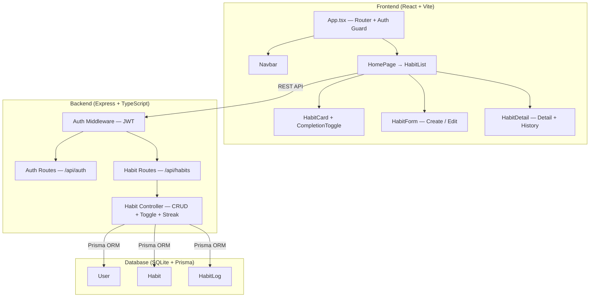
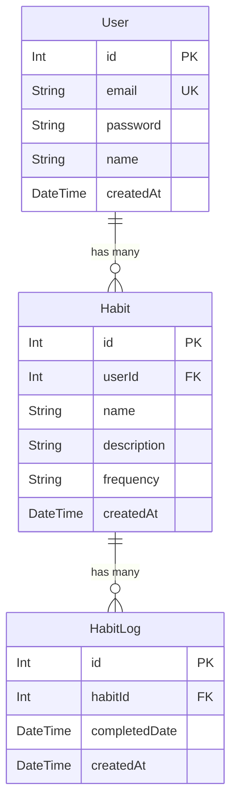
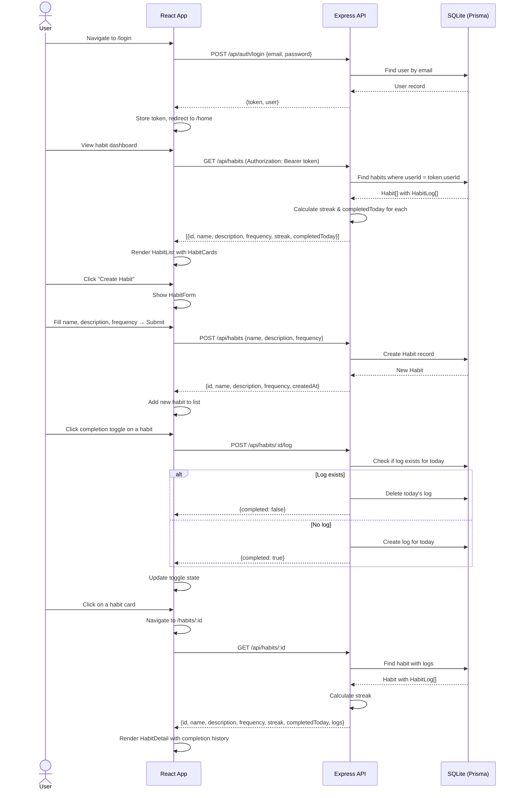
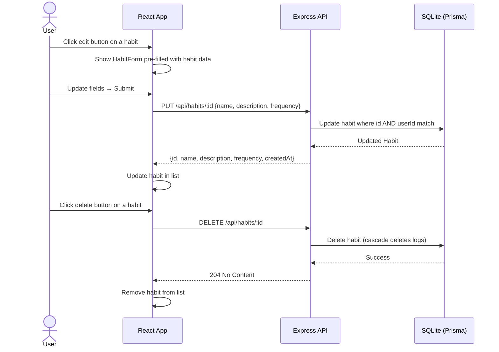

# Habit Tracker App — Design Document
**Date:** 2026-03-09
**Source:** BRD.md + GitHub Issues

## 1. Architecture Overview

The Habit Tracker App follows a three-tier architecture:

- **Frontend** — React + TypeScript SPA served by Vite. Communicates with the backend via REST API calls with JWT tokens in the Authorization header.
- **Backend** — Node.js + Express + TypeScript API server. Handles authentication, habit CRUD, daily completion toggling, and streak calculation. All domain endpoints are protected by JWT middleware.
- **Database** — SQLite via Prisma ORM. Stores users, habits, and habit completion logs.



## 2. Data Model

### Prisma Schema

Pre-existing model (do not modify):

```prisma
// PRE-BUILT — do not modify
model User {
  id        Int      @id @default(autoincrement())
  email     String   @unique
  password  String
  name      String
  createdAt DateTime @default(now())
  habits    Habit[]
}
```

New models added for the habit tracking feature:

```prisma
// NEW — Habit Tracking Feature
model Habit {
  id          Int        @id @default(autoincrement())
  userId      Int
  name        String
  description String
  frequency   String
  createdAt   DateTime   @default(now())
  user        User       @relation(fields: [userId], references: [id])
  logs        HabitLog[]
}

// NEW — Habit Completion Logs
model HabitLog {
  id            Int      @id @default(autoincrement())
  habitId       Int
  completedDate DateTime
  createdAt     DateTime @default(now())
  habit         Habit    @relation(fields: [habitId], references: [id], onDelete: Cascade)

  @@unique([habitId, completedDate])
}
```

### ER Diagram



### Key Design Decisions

| Decision | Rationale | BRD Reference |
|----------|-----------|---------------|
| `completedDate` is DateTime (stored as date-only) | Habits are tracked at daily granularity (Assumption: daily granularity) | FR-005, FR-007 |
| `@@unique([habitId, completedDate])` on HabitLog | Prevents duplicate completions for the same habit on the same day | FR-005 |
| `onDelete: Cascade` on HabitLog → Habit | Deleting a habit removes all associated logs | FR-004, NFR-004 |
| `frequency` is String (not enum) | Values like "Daily", "3x per week", "5x per week" are informational and not enforced | FR-002, Assumption: frequency is informational |
| User has many Habits relation | All habit data is user-scoped; each user can only access their own habits | FR-008 |

## 3. API Endpoints

All habit endpoints require JWT authentication. Unauthenticated requests receive `401 Unauthorized`.

| Method | Path | Description | Auth | Request Body | Response | Status |
|--------|------|-------------|------|-------------|----------|--------|
| GET | /api/habits | List all habits for the current user with today's completion status and streak | Required | — | `[{ id, userId, name, description, frequency, createdAt, completedToday: boolean, streak: number }]` | 200 / 401 |
| POST | /api/habits | Create a new habit | Required | `{ name: string, description: string, frequency: string }` | `{ id, userId, name, description, frequency, createdAt }` | 201 / 401 |
| GET | /api/habits/:id | Get habit details with recent completion logs and streak | Required | — | `{ id, userId, name, description, frequency, createdAt, streak: number, completedToday: boolean, logs: [{ id, completedDate, createdAt }] }` | 200 / 401 / 404 |
| PUT | /api/habits/:id | Update a habit's name, description, or frequency | Required | `{ name?: string, description?: string, frequency?: string }` | `{ id, userId, name, description, frequency, createdAt }` | 200 / 401 / 404 |
| DELETE | /api/habits/:id | Delete a habit and all its logs (cascade) | Required | — | — | 204 / 401 / 404 |
| POST | /api/habits/:id/log | Toggle today's completion for a habit | Required | — | `{ completed: boolean }` | 200 / 401 / 404 |

### Error Response Format

All API errors return JSON with the shape `{ error: string }` and the appropriate HTTP status code (per NFR-006).

### Streak Calculation Logic (FR-007)

```
function calculateStreak(logs: HabitLog[]): number
  1. Sort logs by completedDate descending
  2. Start from today's date
  3. If today has a log, count it and move to yesterday
  4. Else if yesterday has a log, start counting from yesterday
  5. Else return 0
  6. Count consecutive days backward
  7. Return the count
```

- A habit completed today and the previous 4 days → streak of 5
- A habit not completed today but completed yesterday and 3 days before → streak of 4
- A habit not completed today or yesterday → streak of 0

### Route Registration

New habit routes are registered in `src/backend/src/index.ts`:

```typescript
import habitRoutes from './routes/habitRoutes'
app.use('/api/habits', habitRoutes)
```

All routes in `habitRoutes` use the existing `authenticate` middleware from `src/backend/src/middleware/auth.ts`.

## 4. Component Structure

```mermaid
graph TD
    App["App.tsx (Router + Auth Guard)"]
    Navbar["Navbar (data-testid: nav-logo, logout-button)"]
    HomePage["HomePage"]
    HabitList["HabitList (data-testid: habit-list)"]
    HabitCard["HabitCard (data-testid: habit-card)"]
    HabitName["Habit Name (data-testid: habit-name)"]
    HabitDesc["Habit Description (data-testid: habit-description)"]
    HabitFreq["Habit Frequency (data-testid: habit-frequency)"]
    HabitStreak["Habit Streak (data-testid: habit-streak)"]
    CompToggle["CompletionToggle (data-testid: completion-toggle)"]
    EditBtn["Edit Button (data-testid: edit-habit-button)"]
    DeleteBtn["Delete Button (data-testid: delete-habit-button)"]
    CreateBtn["Create Habit Button (data-testid: create-habit-button)"]
    HabitForm["HabitForm (data-testid: habit-form)"]
    NameInput["Name Input (data-testid: habit-name-input)"]
    DescInput["Description Input (data-testid: habit-description-input)"]
    FreqInput["Frequency Input (data-testid: habit-frequency-input)"]
    SubmitBtn["Submit Button (data-testid: habit-form-submit)"]
    HabitDetail["HabitDetail (data-testid: habit-detail)"]
    DetailName["Detail Name (data-testid: habit-detail-name)"]
    DetailDesc["Detail Description (data-testid: habit-detail-description)"]
    DetailFreq["Detail Frequency (data-testid: habit-detail-frequency)"]
    DetailStreak["Detail Streak (data-testid: habit-detail-streak)"]
    CompHistory["Completion History (data-testid: completion-history)"]
    BackBtn["Back Button (data-testid: back-button)"]

    App --> Navbar
    App --> HomePage
    App --> HabitDetail
    HomePage --> HabitList
    HabitList --> CreateBtn
    HabitList --> HabitCard
    HabitCard --> HabitName
    HabitCard --> HabitDesc
    HabitCard --> HabitFreq
    HabitCard --> HabitStreak
    HabitCard --> CompToggle
    HabitCard --> EditBtn
    HabitCard --> DeleteBtn
    HabitList --> HabitForm
    HabitForm --> NameInput
    HabitForm --> DescInput
    HabitForm --> FreqInput
    HabitForm --> SubmitBtn
    HabitDetail --> DetailName
    HabitDetail --> DetailDesc
    HabitDetail --> DetailFreq
    HabitDetail --> DetailStreak
    HabitDetail --> CompHistory
    HabitDetail --> BackBtn
```



### Complete data-testid Reference

| data-testid | Element | Component | Issue Source |
|-------------|---------|-----------|-------------|
| `habit-list` | Container for all habit cards | HabitList | FRONTEND — Dashboard |
| `habit-card` | Individual habit card | HabitCard | FRONTEND — Dashboard |
| `habit-name` | Habit name text in card | HabitCard | FRONTEND — Dashboard |
| `habit-description` | Habit description text in card | HabitCard | FRONTEND — Dashboard |
| `habit-frequency` | Habit frequency text in card | HabitCard | FRONTEND — Dashboard |
| `habit-streak` | Streak count display in card | HabitCard | FRONTEND — Dashboard |
| `completion-toggle` | Toggle button for today's completion | CompletionToggle | FRONTEND — Dashboard |
| `create-habit-button` | "Create Habit" button | HabitList | FRONTEND — Dashboard |
| `habit-form` | Form container (create and edit) | HabitForm | FRONTEND — Dashboard |
| `habit-name-input` | Name input field | HabitForm | FRONTEND — Dashboard |
| `habit-description-input` | Description input field | HabitForm | FRONTEND — Dashboard |
| `habit-frequency-input` | Frequency input/select field | HabitForm | FRONTEND — Dashboard |
| `habit-form-submit` | Form submit button | HabitForm | FRONTEND — Dashboard |
| `habit-detail` | Detail page container | HabitDetail | FRONTEND — Dashboard |
| `habit-detail-name` | Habit name in detail view | HabitDetail | FRONTEND — Dashboard |
| `habit-detail-description` | Habit description in detail view | HabitDetail | FRONTEND — Dashboard |
| `habit-detail-frequency` | Habit frequency in detail view | HabitDetail | FRONTEND — Dashboard |
| `habit-detail-streak` | Streak display in detail view | HabitDetail | FRONTEND — Dashboard |
| `completion-history` | Completion history list | HabitDetail | FRONTEND — Dashboard |
| `back-button` | Back navigation button | HabitDetail | FRONTEND — Dashboard |
| `edit-habit-button` | Edit button on habit | HabitCard / HabitDetail | FRONTEND — Editing |
| `delete-habit-button` | Delete button on habit | HabitCard / HabitDetail | FRONTEND — Editing |

### Frontend Routing

| Route | Component | Description |
|-------|-----------|-------------|
| `/home` | HomePage → HabitList | Habit dashboard (replaces "Features coming soon" placeholder) |
| `/habits/:id` | HabitDetail | Habit detail page with streak and completion history |

The `/habits/:id` route is added to `App.tsx` inside the protected routes block.

### API Service Layer

A new `src/frontend/src/services/habitService.ts` module encapsulates all API calls:

```typescript
// All functions include the JWT token from localStorage in the Authorization header
getHabits(): Promise<Habit[]>
createHabit(data: CreateHabitInput): Promise<Habit>
getHabit(id: number): Promise<HabitDetail>
updateHabit(id: number, data: UpdateHabitInput): Promise<Habit>
deleteHabit(id: number): Promise<void>
toggleCompletion(id: number): Promise<{ completed: boolean }>
```

## 5. Key Flows

### Primary Journey — View, Create, Toggle, Detail



### Extension Journey — Edit and Delete



## 6. Seed Data Specification

Per BRD FR-009 and the DATABASE issue:

| Habit Name | Description | Frequency | Completion Logs | Expected Streak |
|------------|-------------|-----------|-----------------|-----------------|
| Morning Exercise | 30 minutes of morning workout | Daily | Past 5 consecutive days | 5 (if includes today) or 5 |
| Read 30 Minutes | Read a book for at least 30 minutes | Daily | Past 3 consecutive days | 3 (if includes today) or 3 |
| Drink Water | Drink at least 8 glasses of water | Daily | 2 days ago and 3 days ago only | 0 (missed yesterday) |

All seed habits belong to the test user (test@example.com / password123).

## 7. Implementation Order

Per the issue assignment order and AGENTS.md:

1. **[DATABASE] Habit & HabitLog Models** (Step 1/6) — Schema migration + seed data
2. **[BACKEND] Habit Tracking API** (Step 2/6) — GET /api/habits, POST /api/habits, GET /api/habits/:id, POST /api/habits/:id/log
3. **[BACKEND] Habit Edit & Delete API** (Step 3/6) — PUT /api/habits/:id, DELETE /api/habits/:id
4. **[FRONTEND] Habit Dashboard & Tracking** (Step 4/6) — HabitList, HabitCard, HabitForm, HabitDetail, CompletionToggle
5. **[FRONTEND] Habit Editing & Deletion** (Step 5/6) — Edit and delete UI
6. **[PLAYWRIGHT] Habit Tracking Journey** (Step 6/6) — E2E tests for the full journey

## 8. File Structure (New Files)

```
src/
├── backend/
│   ├── prisma/
│   │   └── schema.prisma        ← MODIFIED (add Habit, HabitLog)
│   │   └── seed.ts              ← MODIFIED (add domain seed data)
│   └── src/
│       ├── routes/
│       │   └── habitRoutes.ts   ← NEW
│       ├── controllers/
│       │   └── habitController.ts ← NEW
│       └── index.ts             ← MODIFIED (register habit routes)
├── frontend/
│   └── src/
│       ├── pages/
│       │   └── HomePage.tsx     ← MODIFIED (replace placeholder)
│       ├── components/
│       │   ├── HabitList.tsx    ← NEW
│       │   ├── HabitCard.tsx    ← NEW
│       │   ├── HabitForm.tsx    ← NEW
│       │   ├── HabitDetail.tsx  ← NEW
│       │   └── CompletionToggle.tsx ← NEW
│       └── services/
│           └── habitService.ts  ← NEW
└── e2e/
    └── habits.spec.ts           ← NEW (Playwright)
```
